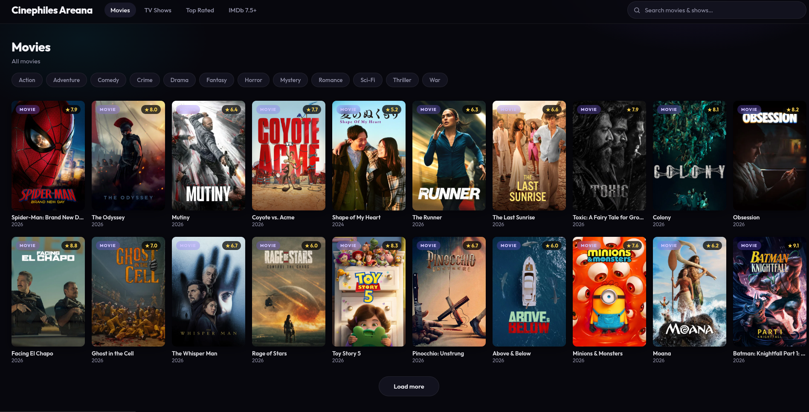
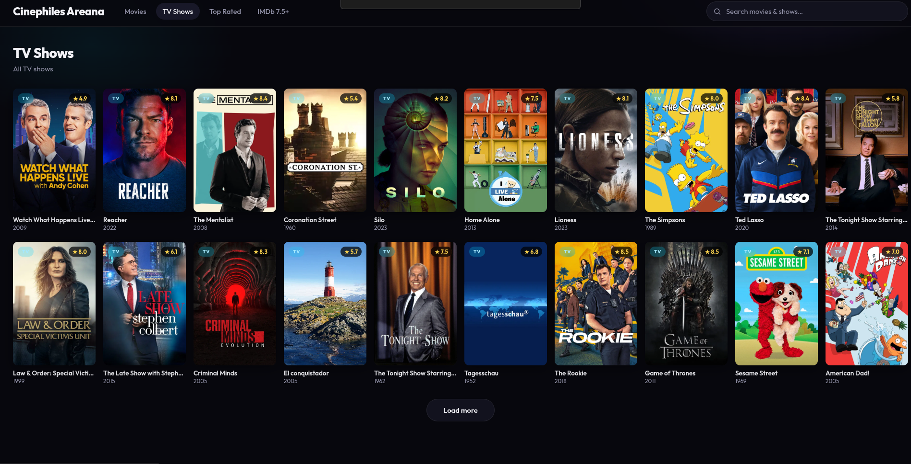
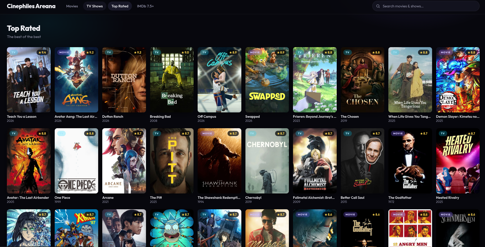
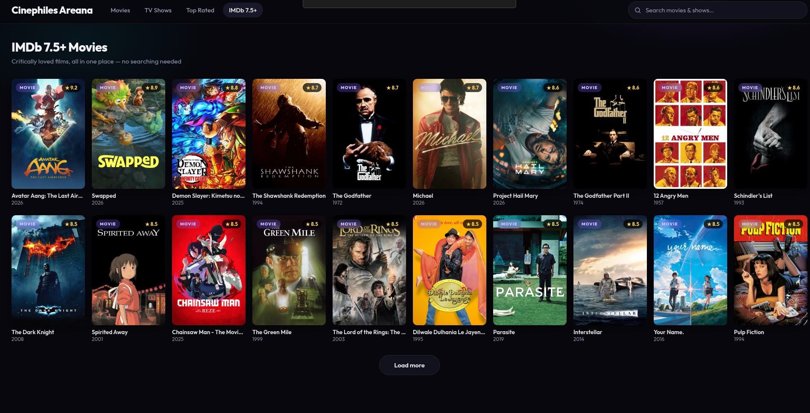

# Cinephiles Areana

## Watch Any Movie — Free, Forever.

**Watch it live: [https://cinephilia-vercel.vercel.app](https://cinephilia-vercel.vercel.app) — Click here and let me know how it was!**

**Pure, uninterrupted cinema. No ads. No login. No interruptions. Just you and the movie.**

## Why you'll love it

- **Watch any movie for free** — movies, series & documentaries, all in one place
- **20× Volume Boost** — hear every whisper, even on quiet laptop speakers
- **Zero ads** — nothing popping up, nothing hijacking your player
- **No login** — no accounts, no emails, no passwords. Just press play
- **English subtitles** — turn them on with one click
- **Pure uninterrupted cinema** — zero buffering, smooth playback from start to end

> **Entertainment should be free.** That's the whole idea.

---

## See it in action

| | |
|:---:|:---:|
|  |  |
|  |  |

---

## How to start watching

1. **Open the app** in your browser (or run it on your own machine — see the tech guide below).
2. **Search** for anything you want to watch.
3. **Press play.** That's it. Enjoy the movie.

---

## Feedback & Bugs

- **Tried it? [Click here](https://cinephilia-vercel.vercel.app) and let me know how it was!**
- Found a bug or something not working? [Create an issue](https://github.com/roarscarch/cinephile-areana/issues/new) and I'll fix it.

---

## Want the technical stuff?

If you're a developer (or just curious how it works under the hood — architecture,
providers, deployment, encryption internals, etc.), everything lives in
**[TECHNICAL.md](TECHNICAL.md)**.

---

*Made for movie lovers, by movie lovers.*

